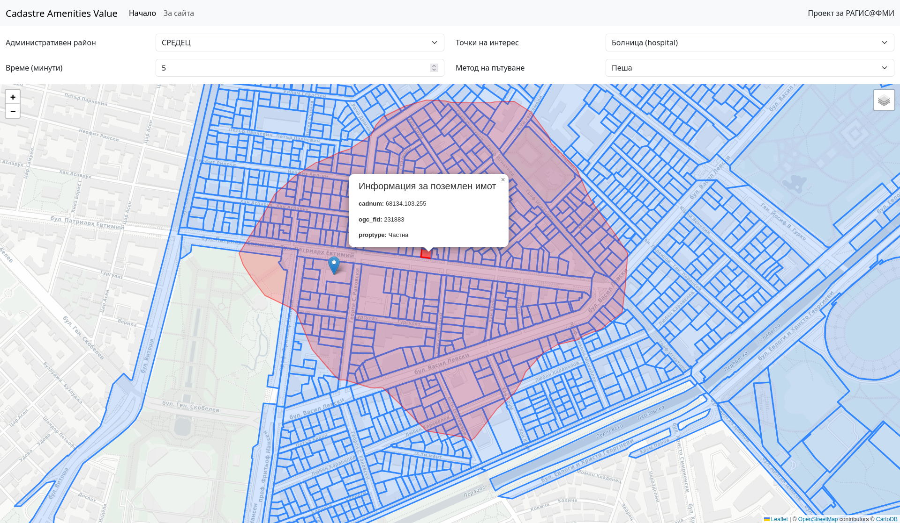

# Cadastre Amenities Value

Проект за курс „Разработка и архитектура на географски информационни системи“
във [ФМИ на СУ](https://www.fmi.uni-sofia.bg/).



*Екранна снимка от приложенито: Избран имот в район Средец и показан изохрон за 5-минутно разстояние на пешеходна достъпност, заедно с точка на интерес, попадаща в него.*

## Общ преглед на проекта

Платформата предоставя интерактивна карта за град София. Чрез падащо меню потребителят избира конкретен район, за който
се визуализират кадастрални данни. При селектиране на поземлен имот, системата генерира изолиния, изхождаща от центроида
на имота, и идентифицира ключови точки на интерес по нея. За допълнителна персонализация са достъпни контроли за
задаване на времеви диапазон, метод на придвижване и категория на показваните точки на интерес.

Уебсайтът интегрира отворени кадастрални данни
от [Агенцията по геодезия, картография и кадастър (АГКК)](https://www.cadastre.bg/), данни за административните
райони на София от [Софияплан](https://sofiaplan.bg/) и информация за точки на интерес,
извлечени от [OpenStreetMap](https://www.openstreetmap.org/), като използва функционалността
на [Geoapify](https://www.geoapify.com/) за изчисляване на изолинии.

**Потребителят избира район** от падащо меню, за да се покажат кадастрални имоти за съответния административен район.
При кликване върху поземлен имот се изчертава **изолиния спрямо неговия центроид**, като се отбелязват специфични точки
на интерес. Налични са настройки за времето, начина на придвижване и вида на точките на интерес.

При кликване на случайно място от картата анализът бива извършен по същия начин както и при кликване на кадастрален
имот, като вместо центроид, се взимат координатите на кликването. С цел демонстрация, първото се визуализира със зелен
цвят, а второто с червен.

Допълнително, поради демонстрационни и тестови причини първоначално се зареждат случайни данни от кадастъра на
територията на Столична община.

## Системни изисквания

За да стартирате този проект, ще ви трябват следните инсталирани на вашата система:

* **PostgreSQL:** Версия 17 или по-нова;
* **PostGIS разширение:** Съвместимо с вашата версия на PostgreSQL;
* **Python:** Версия 3.13 или по-нова.

## Как да стартирате

1. **Настройка на база данни:**
    1. Уверете се, че `postgis` разширението е инсталирано.
    2. Възстановете предоставения `pg_dump` файл във вашата PostgreSQL база данни. Това ще създаде необходимите
       таблици. **Данните трябва да бъдат попълнени допълнително, като бъдат изтеглени от АГКК и Софияплан**.

       Примерен код, използвайки `psql`:

          ```shell
          psql -U вашето_потребителско_име -d името_на_вашата_база_данни -f ./postgis_dump.sql
          ```

2. **Python среда:**
   Инсталирайте необходимите Python библиотеки, използвайки `pip`:

      ```shell
      pip install -r requirements.txt
      ```

3. **Настройване на променливите на средата**: Използвайки дадения примерен `.env`файл, попълнете нужните
   данни за своята система.

4. **Изпълнение на основния скрипт на проекта:**

      ```
      python app.py
      ```
